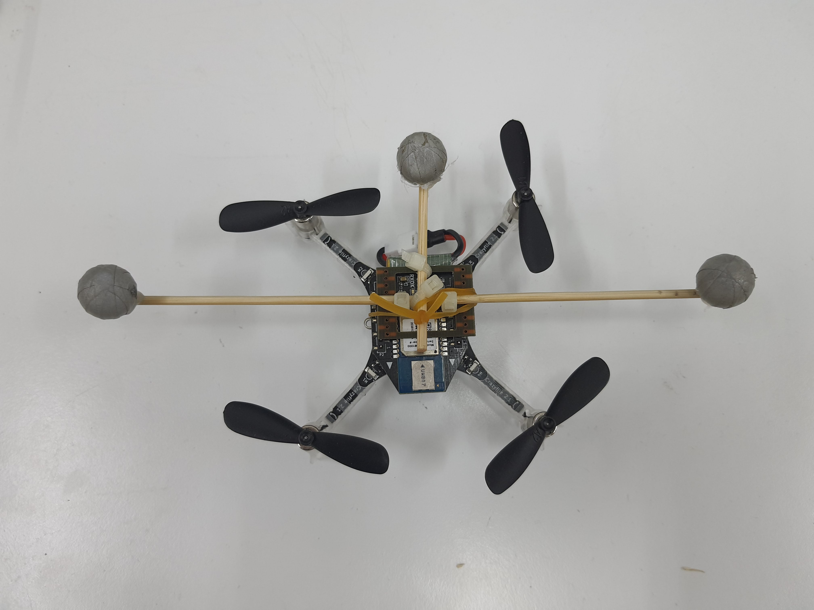
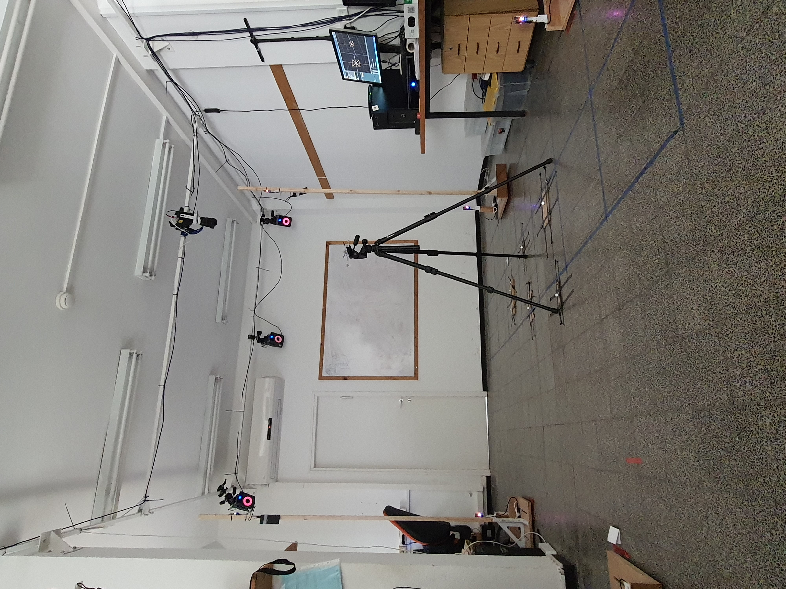

# LPS_Error_mapping_Vicon
Mapping loco positioning system error using Vicon motion capture system

As part for my thesis I used Crazyflie drone.
The Crazyflie gets its position from LPS system, based on UWB technology.
In this project I mapped the errors of the LPS system, using the Vicon motion capture as ground truth.

first, I cablibrated the LPS and Vicon coordinates system

then I placed reflective markers on the drone:

 

I sampled the space for several LPS antenna configuration

finally I intepolated the samples to get the error map:
